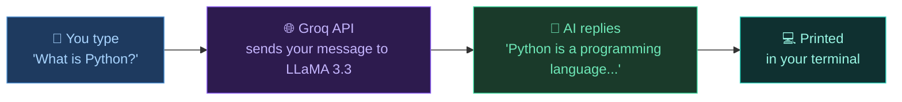
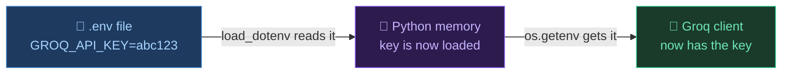
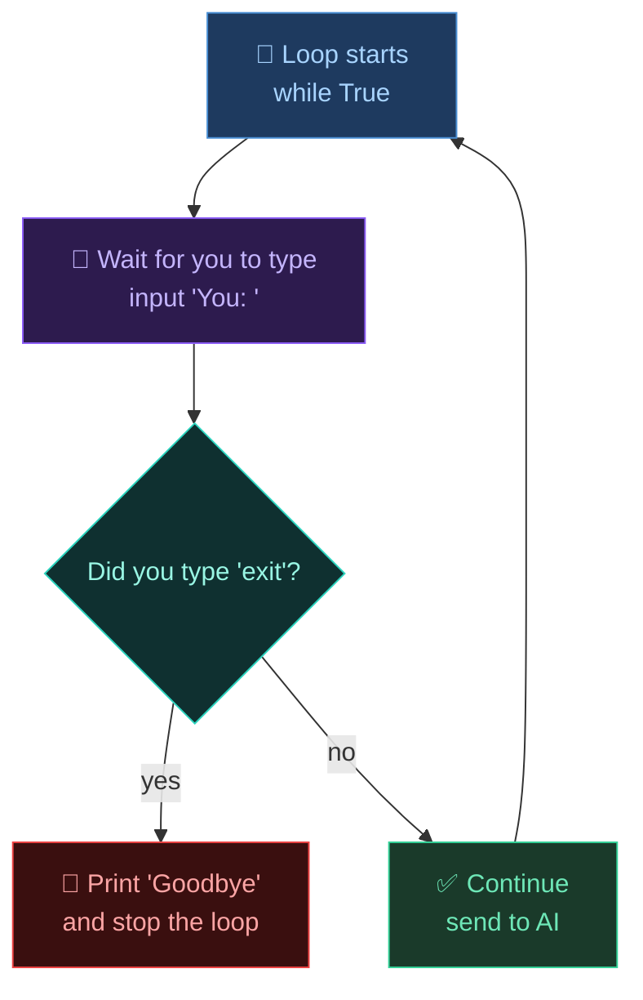
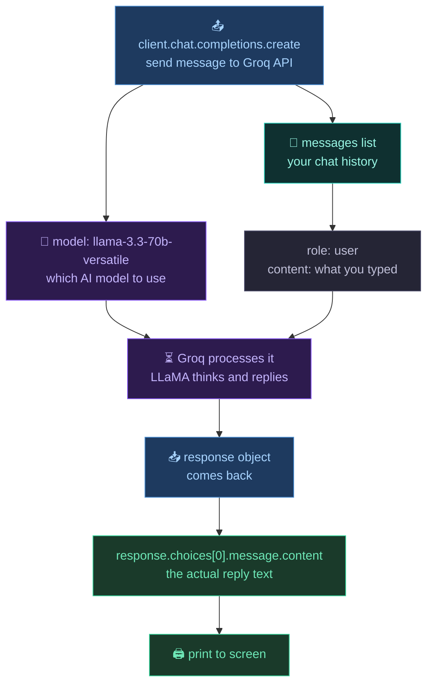
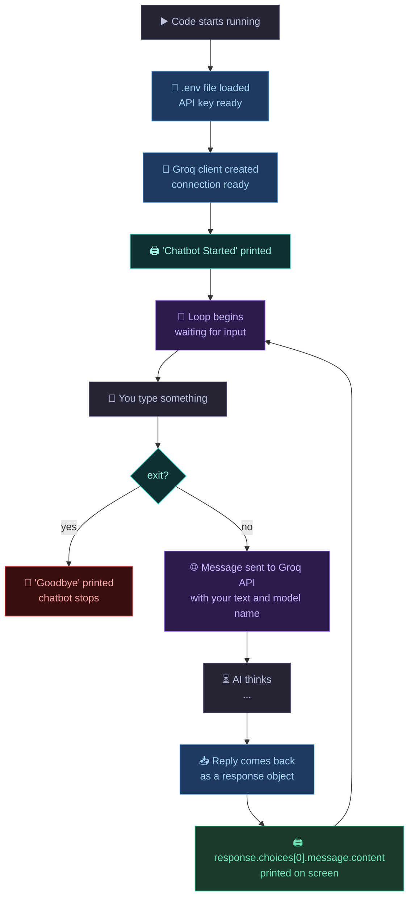
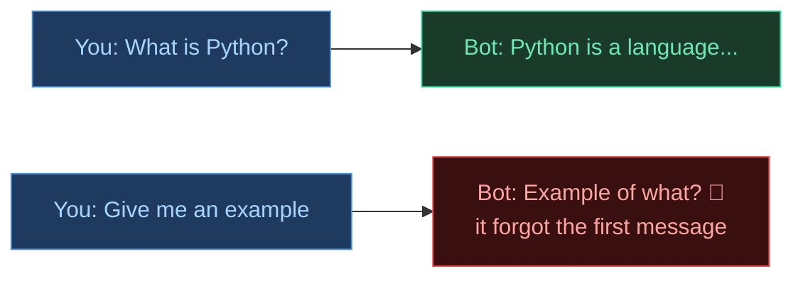
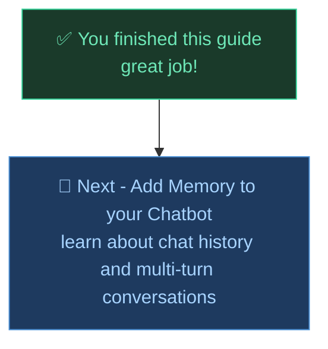

# 🤖 Building Your First AI Chatbot with Groq

I made this because after learning what an LLM is, the next question is obvious okay but how do I actually talk to one with code? This is the simplest way to do it. No extra stuff. Just a working chatbot in under 20 lines of Python.

---

## Table of Contents

1. [What are we building?](#what-are-we-building)
2. [What you need first](#what-you-need-first)
3. [The full code](#the-full-code)
4. [Line by line - what each part does](#line-by-line---what-each-part-does)
   - [Part 1 - Imports](#part-1---imports)
   - [Part 2 - API Key setup](#part-2---api-key-setup)
   - [Part 3 - The chat loop](#part-3---the-chat-loop)
   - [Part 4 - Sending the message](#part-4---sending-the-message)
5. [How it all flows](#how-it-all-flows)
6. [Word List](#word-list)

---

## What are we building?

A simple chatbot that runs in your terminal. You type something. It replies. That is it.

Under the hood it is using **Groq** a platform that lets you call powerful AI models like LLaMA 3.3 through an API. Think of it like texting an AI you send a message, it sends one back.



---

## What you need first

Before running the code you need two things installed and one account set up.

**Install these with pip:**
```bash
pip install groq python-dotenv
```

**Create a `.env` file** in the same folder as your code and put this inside it:
```
GROQ_API_KEY=your_key_here
```

Get your free API key from [console.groq.com](https://console.groq.com). It takes two minutes.

---

## The full code

```python
from groq import Groq
from dotenv import load_dotenv
import os

# Load environment variables
load_dotenv()

# Create client
client = Groq(
    api_key=os.getenv("GROQ_API_KEY")
)

print("Chatbot Started (type 'exit' to quit)\n")

while True:
    user_input = input("You: ")

    if user_input.lower() == "exit":
        print("Bot: Goodbye!")
        break

    response = client.chat.completions.create(
        model="llama-3.3-70b-versatile",
        messages=[
            {
                "role": "user",
                "content": user_input
            }
        ]
    )

    print("Bot:", response.choices[0].message.content)
```

---

## Line by line - what each part does

### Part 1 - Imports

```python
from groq import Groq
from dotenv import load_dotenv
import os
```

These three lines bring in the tools we need.

| Line | What it does |
|------|-------------|
| `from groq import Groq` | brings in the Groq library so we can talk to the AI |
| `from dotenv import load_dotenv` | lets us read our secret API key from a file |
| `import os` | lets Python read things from that file |

Think of imports like plugging in a charger before using your phone. You need them ready before anything else works.

---

### Part 2 - API Key setup

```python
load_dotenv()

client = Groq(
    api_key=os.getenv("GROQ_API_KEY")
)
```



**Why not just write the key directly in the code?**

Because if you share your code on GitHub, everyone can see your key. People steal keys and use them to send thousands of API calls on your account. Always put keys in a `.env` file and add `.env` to your `.gitignore`.

`load_dotenv()` reads the `.env` file and loads everything inside it into Python's memory.

`os.getenv("GROQ_API_KEY")` then fetches the key by name and passes it to the Groq client.

The `client` is now your connection to the Groq API. Ready to use.

---

### Part 3 - The chat loop

```python
while True:
    user_input = input("You: ")

    if user_input.lower() == "exit":
        print("Bot: Goodbye!")
        break
```



`while True` means - keep running forever until we say stop.

`input("You: ")` shows the text "You: " on screen and waits for you to type something. Whatever you type gets saved in `user_input`.

`user_input.lower() == "exit"` - the `.lower()` part converts what you typed to lowercase first. So whether you type "EXIT" or "Exit" or "exit" it will all match. When it matches - `break` stops the loop.

---

### Part 4 - Sending the message

```python
response = client.chat.completions.create(
    model="llama-3.3-70b-versatile",
    messages=[
        {
            "role": "user",
            "content": user_input
        }
    ]
)

print("Bot:", response.choices[0].message.content)
```

This is the main part. This is where you actually talk to the AI.



**Breaking down `response.choices[0].message.content`**

This looks confusing but it is just going deeper into an object step by step.

| Part | What it means |
|------|--------------|
| `response` | the full reply from Groq |
| `.choices` | a list of possible replies (usually just 1) |
| `[0]` | take the first one |
| `.message` | the message inside that choice |
| `.content` | the actual text of the reply |

Think of it like opening a package. `response` is the box. `.choices[0]` is the item inside. `.message.content` is the thing written on the item.

---

## How it all flows



---

## Word List

| Word | Simple meaning |
|------|--------------|
| API | a way for two programs to talk to each other |
| Groq | a platform that runs AI models really fast |
| LLaMA 3.3 70B | a powerful open-source AI model made by Meta |
| `.env` file | a hidden file where you store secret keys |
| `load_dotenv()` | reads your `.env` file and loads the keys |
| `os.getenv()` | fetches a specific key from memory by name |
| `client` | your connection to the Groq API |
| `while True` | a loop that runs forever until you say break |
| `break` | stops the loop |
| `input()` | pauses the code and waits for you to type |
| `response` | the full reply object that comes back from Groq |
| `.choices[0]` | the first reply option in the response |
| `.message.content` | the actual text of the AI's reply |
| `model` | which AI brain you are using to answer |

---

## What is missing from this chatbot?

This chatbot does not remember anything. Every message you send starts fresh. The AI does not know what you said two messages ago.



This is called having no **memory**. The next guide will show how to fix this by sending the full chat history with every message.

---

## What's Next?



---

*Made by Abdul Samad*
